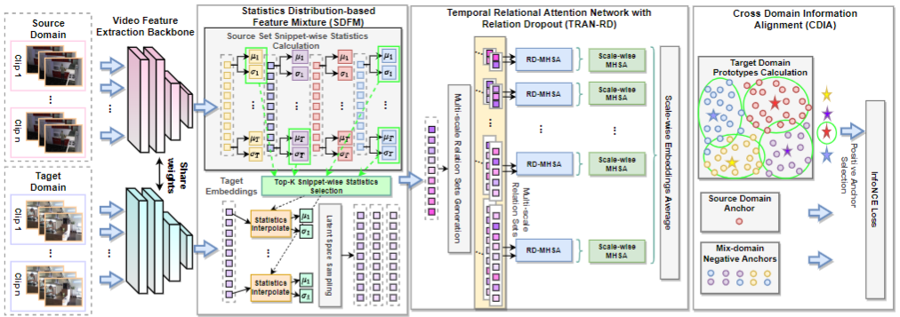

# RelaMiX: Exploring Few-Shot Adaptation in Video-based Action Recognition


## Contents
Domain adaptation is essential for activity recognition, as common spatiotemporal architectures risk overfitting due to increased parameters arising from the temporal dimension. Unsupervised domain adaptation methods have been extensively studied, yet, they require large-scale unlabeled data from the target domain. 

In this work, we address Few-Shot Domain Adaptation for video-based Activity Recognition (FSDA-AR), which leverages a very small amount of labeled target videos to achieve effective adaptation. This setting is attractive and promising for applications, as it requires recording and labeling only a few, or even a single example per class in the target domain, which often includes activities that are rare yet crucial to recognize. We construct FSDA-AR benchmarks using five established datasets considering diverse domain types: UCF101, HMDB51, EPIC-KITCHEN, Sims4Action, and ToyotaSmartHome.  We further propose a novel approach, RelaMiX, to better leverage the few labeled target domain samples as knowledge guidance.

RelaMiX encompasses a temporal relational attention network with relation dropout, alongside a cross-domain information alignment mechanism. Furthermore, it integrates a mechanism for Mixing features within a latent space, which is cognizant of data snippets.
## Requirements
* support Python 3.7, PyTorch 1.12, CUDA 11.3
* install all the library with: `pip install -r requirements.txt`
## Dataset Preparation
Please refer to the dataset_preparation folder to prepare the temporal features by using I3D method.
The pretrained weights could be derived from [https://github.com/piergiaj/pytorch-i3d/tree/master/models]
Please refer to this repo for the feature extraction, we follow the same way with theirs. [https://github.com/ldkong1205/TranSVAE]
### Data structure
You need to extract frame-level features for each video to run the codes. To extract features, please check [`dataset_preparation/`](dataset_preparation/).

Folder Structure:
```
DATA_PATH/
  DATASET/
    list_DATASET_SUFFIX.txt
    RGB/
      CLASS_01/
        VIDEO_0001.mp4
        VIDEO_0002.mp4
        ...
      CLASS_02/
      ...

    RGB-Feature/
      VIDEO_0001/
        img_00001.t7
        img_00002.t7
        ...
      VIDEO_0002/
      ...
```
`RGB-Feature/` contains all the feature vectors for training/testing. `RGB/` contains all the raw videos.

There should be at least two `DATASET` folders: source training set  and validation set. If you want to do domain adaption, you need to have another `DATASET`: target training set.

### File lists for training/validation
Please check the folder for EPIC_KITCHEN_FSDA_AR_protocols, hmdb_ucf_FSDA_AR_protocols, and Sims4TSH_FSDA_AR_protocols.
we also provided the model weights in https://drive.google.com/drive/folders/1Fxj8ylY-eLE87sM1EVBo_a5Pb5OB2n7E?usp=drive_link and the features used in EPIC-KITCHEN, note that they are newly trained weights, which might have slight deviations due to the randomness of the library. In case your reproduced results from your own trained models are different we suggest you to run multiple times or different seeds.


